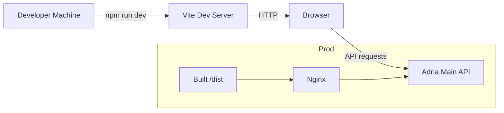

<div align="center">

# 🥗 Adria — Client

**Vue 3 single-page application built with Vite; production served as static assets via Nginx.**


</div>

> 🎓 Created as part of a simulated 2084 "Return to Earth" startup coursework: marketing site and product POC for NutriScan.

## 📖 About

- Frontend SPA located in the `client/` folder using **Vue 3** and **Vite**.
- Built artifacts are produced to `dist/` and served by the `client/Dockerfile` with **Nginx**.


## 🏗️ Architecture




## ✨ Features

- Fast dev server via Vite
- Componentized Vue structure (scanner, shop, statistics, tracker)
- Production multi-stage Docker build (Node -> Nginx)


## 🛠️ Tech Stack

| Area | Technologies |
|------|--------------|
| Frontend | Vue 3, Vite, JavaScript |
| Bundler | Vite |
| Container runtime | Nginx (static assets) |


## 🚀 Getting Started

### Prerequisites

- Node.js (see `client/package.json` engines: `^20.19.0 || >=22.12.0`)
- npm


### Configuration

| Variable | Description |
|----------|-------------|
| `BUILD_ENV` | Optional build argument used in `client/Dockerfile` (ARG BUILD_ENV=dev) |


### Development

```bash
npm ci
npm run dev
```

### Build (production)

```bash
npm ci
npm run build
```

### Build Docker image (optional)

```bash
docker build -t adria-client:latest .
# docker run -p 80:80 adria-client:latest  # replace tag as needed
```


## 📡 Usage

- Dev server: open the URL shown by `npm run dev`.
- Production (container): built `dist/` served by Nginx on port `80` when run in Docker (see `client/Dockerfile`).


## 👤 Author

| Name | GitHub | LinkedIn |
| --- | --- | --- |
| Maurice De Kegel | [MriceDK](https://github.com/MriceDK) | [LinkedIn](https://www.linkedin.com/in/dekegelmaurice/) |
